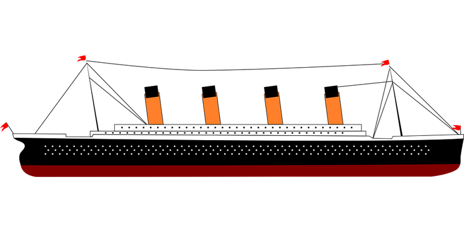
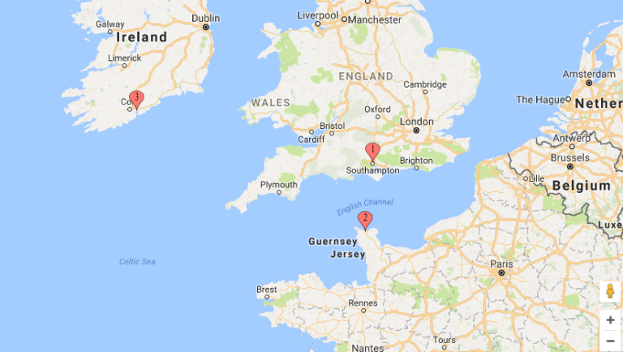
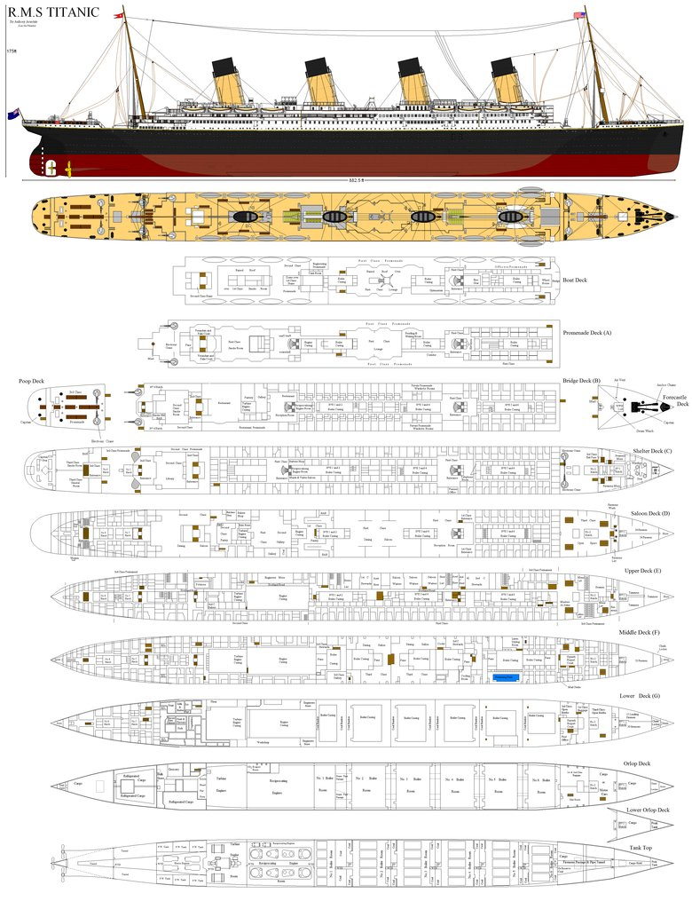
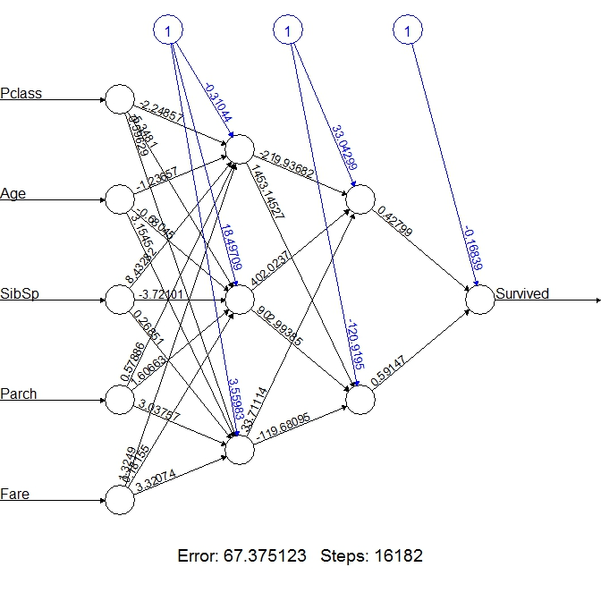
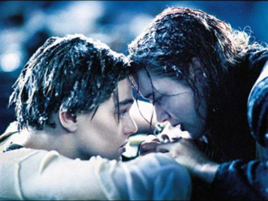

# Titanic dataset



## Introduction

Titanic dataset is a classic dataset to start your AI/Machine learning journey.

It consists of a list of passengers and their characteristics, the outcome being if they survived or not to the tragedy.

Dataset is available here.

https://www.kaggle.com/c/titanic/data

Please reefer to my website for deeper explanation thant the readme.

## Libraries

Let’s load up some data in R, clean it, build some new features, pick the right algorithm and make our prediction. For this study, the databases are provided. We do not have to gather and merge data from different sources. We can directly begin the analysis with R. I begin by loading some basics libraries in R.

```
library(dplyr) #sorting, merging, filtering, grouping data library
library(ggplot2) #visualization library
library(mice)
library(neuralnet)#deep neural network prediction model
library(randomForest)
library(dplyr) #sorting, merging, filtering, grouping data library
library(ggplot2) #visualization library
library(mice)
library(neuralnet)#deep neural network prediction model
library(randomForest)
And set the working directory
```

## Datasets

### Train
The training dataset provided contains 891 peoples (examples) with their characteristics (features) and the output value (Y) depending on weither their survived (Y=1) or not (Y=0). Let’s have a look to the different features :

PassengerId : just a number which refers to the passenger
Survided : the output we would like to predict.
Pclass : passenger class. 1st being the upper class, 3rd the lower
Name : name of the passenger. can be xx.5 years (estimated ages)
Sex : Sex of the passenger
Age : age of the passenger
SibSp : number of Siblings/Spouses aboard
Parch : number of Parents/Children aboard
Ticket : Ticket Numer
Fare : price of the ticket
Cabin : cabin



Embarked : Port of embarkation (C = Cherbourg ; Q = Queenstown ; S = Southampton)

```
train<-read.csv("train.csv",stringsAsFactors = FALSE,header=TRUE,na.strings=c("NA", ""))
train<-tbl_df(train)
head(train) #have a look to the training set

str(train)
sapply(train, function(x) sum(is.na(x)))
train<-read.csv("train.csv",stringsAsFactors = FALSE,header=TRUE,na.strings=c("NA", ""))
train<-tbl_df(train)
head(train) #have a look to the training set
 
str(train)
sapply(train, function(x) sum(is.na(x)))
```

## Results
Age, Cabin and Embarked values are missing. We will have to manage this missing values in a better way (Estimated age? mean age?) in order to feat our predictive model correctly. We could notice that 2 peoples do not have information about their embarkation location but I doubt it has any effect on either they survived or not so I’ll just drop this feature out.

Some features needs to be studied more deeply. Here are few reasons to try to get deeper into the data :

Name : contains a lot of information depending on the title and the origin of the name. Could give information such as relationship, ethnics, age, native language.
Cabin : Each values begins with a letter which we could assume to be the letter representing a deck on the boat. Looking at Wikipedia, we could see that A,B are the highest decks while F,G are the deepest in the boat. D Deck was the saloon Deck with large public rooms.


Titanic left the harbor of Southampton (England) on 10 April 1912. After calling at Cherbourg (France) and Queenstown (Ireland), he began his journey through Atlantic ocean.

Few words about the test dataset. We are asked to predict survival for 418 new passengers. Here is the table for missing values :

```
test<-read.csv("test.csv",stringAsFactors=FALSE,header=TRUE)
sapply(test, function(x) sum(is.na(x)))

test<-read.csv("test.csv",stringAsFactors=FALSE,header=TRUE)
sapply(test, function(x) sum(is.na(x)))
```

## Results
86 Age values and 1 Fare values are missing for the testing set. We will have to fill missing values to process the data through our model.

## Reduced version
We are going to use the neuralnet library. It’s really easy to implement and it’s a good way to apprehend how deep neural network are working. You can refer to the documentation for further information.

```
train_reduce<-select(train,Survived,Pclass,Age,SibSp,Parch,Fare)

train_reduce<-select(train,Survived,Pclass,Age,SibSp,Parch,Fare)
formula="Survived~Pclass+Age+SibSp+Parch+Fare"

formula="Survived~Pclass+Age+SibSp+Parch+Fare"
train_reduce_na=na.omit(train_reduce)
train_reduce_na[,2:6]<-scale(train_reduce_na[,2:6]) #scaling each feature with mean to 0
test_reduce_na=train_reduce_na[601:714,]
train_reduce_na=train_reduce_na[1:600,]

train_reduce_na=na.omit(train_reduce)
train_reduce_na[,2:6]<-scale(train_reduce_na[,2:6]) #scaling each feature with mean to 0
test_reduce_na=train_reduce_na[601:714,]
train_reduce_na=train_reduce_na[1:600,]
nn1<-neuralnet(formula,train_reduce_na,hidden=c(3))
plot(nn1)

nn1<-neuralnet(formula,train_reduce_na,hidden=c(3))
plot(nn1)
```

We can try to evaluate the accuracy of this first naive model. Let’s make prediction on the testing set and compare with real values.

```
test_prediction<-compute(nn1,test_reduce_na[,2:6])$net.result
test_prediction<-round(test_prediction)
test_prediction<-cbind(test_prediction,test_reduce_na$Survived)
colnames(test_prediction)<-c("Predicted","Real")

test_prediction<-compute(nn1,test_reduce_na[,2:6])$net.result
test_prediction<-round(test_prediction)
test_prediction<-cbind(test_prediction,test_reduce_na$Survived)
colnames(test_prediction)<-c("Predicted","Real")
We can count the quantity of rows which have matching data using a for loop and a nested if testing.

total_ok=0
for (row in (1:dim(test_prediction)[1])){
  if (test_prediction[row,1]==test_prediction[row,2]){
    total_ok=total_ok+1
  }
  
  
}
accuracy=total_ok/dim(test_prediction)[1]
print(accuracy)

total_ok=0
for (row in (1:dim(test_prediction)[1])){
  if (test_prediction[row,1]==test_prediction[row,2]){
    total_ok=total_ok+1
  }
  
  
}
accuracy=total_ok/dim(test_prediction)[1]
print(accuracy)
```

## Results

Accuracy with this simple model is around 70%. In order to improve the model, we need to implement a better use of the other parameters. Especially, we removed the gender information from our model, and it seems that clearly have an impact on either or not the individual survived or not. Also, we can question the model choosed (neural network), is it the best to fit our data?


## Features engineering
Passenger title (from Megan Risdal kernel on Kaggle.com)

Title : let’s try to extract the title from the Name feature. We will have to use regular expressions for that one.

gsub(regular expression,replacement,string, perl=TRUE) we replace the character matching with regular expression by ‘ ‘ (NULL character) in string.

We have 17 categories for title. Some categories have the same meaning so we need to merge them :

Miss / Mlle = Miss (Mlle French for Miss)
Mr / Mrs / Ms = Mr. I also want to merge Sir in this category.
Missing ages
We will do something really simple to fill the NA values for the age. We will simply input the average age for them.

Passenger deck
Do we have enough data to determinate the deck of each passenger, depending on the fare of their ticket. It was late at night (11:40 pm) when the boat encountered the iceberg. I assume that most of passenger were in their respective cabins. Lower decks may be more difficult to escape as they are far from exit on the top of the boat. Room number (the numerals after the letter) are more difficult to exploit and we will drop this part for the study.

Here is a short description of each deck and a link with a “blue print” of the different decks (from upper to lower deck)



Deck A : promenade deck
Deck B : bridge deck
Deck C : shelter deck
Deck D : saloon deck
Deck E : upper deck
Deck F : middle deck
Deck G : lower deck
Orlop deck : It’s the lowest deck in a boat, the one very near to the bottom
Let’s try to build a model which can match a Deck with the price of the ticket, so we will be able to fill the blank.

We need now to check what’s the price range for the different decks. Also we have to take into account that some people have several room for their price (so we will have to divide the price per the number of room to be able to compare everything properly).

Now we have all the information (deck and unitprice) to try to build a classification model (predict the deck with the unit price). The repartition of the unit prices per deck are :

As expected, the lower decks are the cheapest one. Decks B&C seems to be the most expensive decks. We can notice strong overlaps of the categories. I hope that any error between close decks will not have a big influence on the final prediction model.

Deck A could be a problem, as it has fairly low price and is far from D and E decks. On the blue print it seems that there are only few rooms on that deck, I decided to remove it from our deck prediction model (room around that price will rather be deck from D and E decks).

Let’s predict empty value with a deep neural network prediction model.



Now that we have a a model, we can try to predict the cabin’s deck for each passenger having a look to the fare price.

Input normalization
Now that we have complete our training dataset, it’s recommended to normalize the data before we process it through the deep neural network. We can simply use the native scale function from R.

To feed our network, I decide to keep the following parameters (which seems to be relevant regarding the survival probability of each individual) :

- Plcass
- Sex
- Age
- SibSp and Parch
- Fare of the ticket
- Deck of the cabin
I’ll use a neuralnetwork classifier to predict the output.

## Conclusion

Does our model fit to the 1997 movie from James Cameron? Is Jack likely to die and Kate likely to survive. According to the Wikipedia page, we can retrieve lot of information about our 2 characters.

Jack : Pclass(3), Name(Jack),Sex(Male),Age(17),SibSp(0),Parch(0),Ticket(??), Fare(100), Deck(???), Embarked(Southampton), title(Mr)

Kate : Pclass(1), Name (Kate), Sex(Female), Age(17), SibSp(1), Parch(1),Ticket(??), Fare(1), Deck(???), Embarked(Southampton),title(Miss)

Our model predicts that Jack died and that Kate survived. It’s in accordance with the movie!

Processing this data to our model matches with the movie’s scenario ^^.



