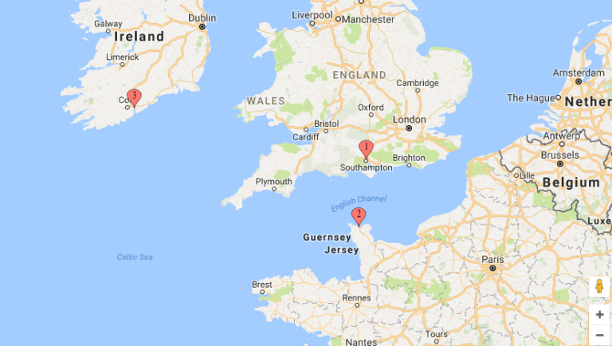
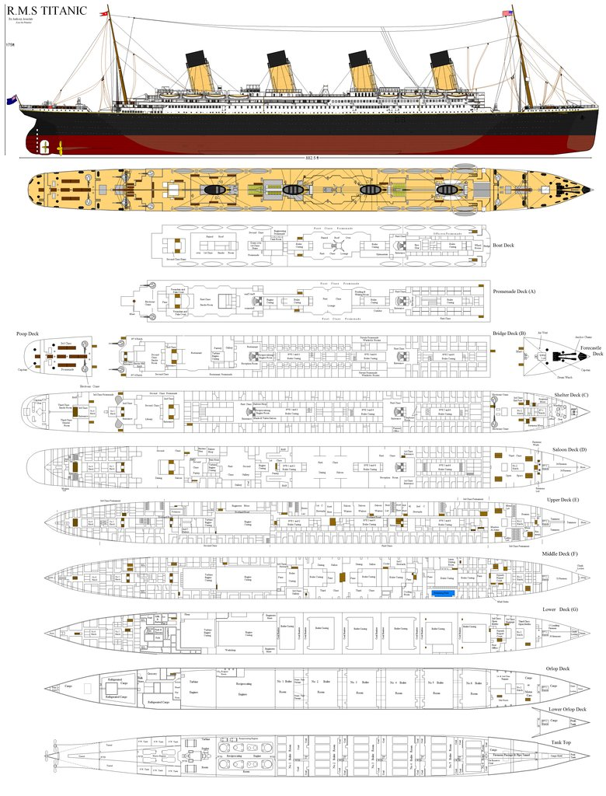
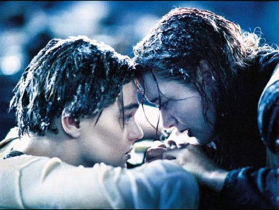

##Introduction

The Titanic dataset form Kaggle is famous to start with machine learning. Given a list of people who either survived or died during the Titanic sinking, we are asked to build a predictive model to determinate if regarding some features some other passengers have survived or not. Here is my solution to solve this topic.

Let's load up some data in R, clean it, build some new features, pick the right algorithm and make our prediction. For this study, the databases are provided. We do not have to gather and merge data from different sources. We can directly begin the analysis with R. I begin by loading some basics libraries in R (routine)

```{r message=FALSE}
library(dplyr) #sorting, merging, filtering, grouping data library
library(ggplot2) #visualization library
library(polycor)
library(neuralnet)#deep neural network prediction model
library(randomForest)
```

And set the working directory


```{r include=FALSE}
setwd("C:\\Users\\Nicolas\\Google Drive\\website\\R-titanic")
```


##Datasets

The training dataset provided contains 891 peoples (examples) with their characteristics (features) and the output value (Y) depending on weither their survived (Y=1) or not (Y=0). Let's have a look to the different features :

PassengerId : just a number which refers to the passenger
Survided : the output we would like to predict.
Pclass : passenger class. 1st being the upper class, 3rd the lower
Name : name of the passenger. can be xx.5 years (estimated ages)
Sex : Sex of the passenger
Age : age of the passenger
SibSp : number of Siblings/Spouses aboard
Parch : number of Parents/Children aboard
Ticket : Ticket Numer
Fare : price of the ticket
Cabin : cabin
Embarked : Port of embarkation (C = Cherbourg ; Q = Queenstown ; S = Southampton)
    
```{r}
train<-read.csv("train.csv",stringsAsFactors = FALSE,header=TRUE,na.strings=c("NA", ""))
train<-tbl_df(train)
head(train) #have a look to the training set

str(train)
sapply(train, function(x) sum(is.na(x)))
```

We can easily check missing values. It may be a little bit trickier for the features with a lot of unique values. Here is a tip to check quantities of na values.

Age, Cabin and Embarked values are missing. We will  have to manage this missing values in a better way (Estimated age? mean age?) in order to feat our predictive model correctly. We could notice that only 2 peoples do not have information about their embarkation location.

Some features needs to be studied more deeply. Here are few reasons to try to get deeper into the data :

Name : contains a lot of information depending on the title and the origin of the name. Could give information such as relationship, ethnics, age, native language.
Sibsp, Parch : both information combined with Name should allow us to reconstruct families inside the boat. It may help us to fill NA values or to create new features to feed our prediction.
Ticket : some tickets id includes letters at the beginning. We should dig to find out what it means.
Cabin : Each values begins with a letter which we could assume to be the letter representing a deck on the boat. Looking at Wikipedia, we could see that A,B are the highest decks while F,G are the deepest in the boat. D Deck was the saloon Deck with large public rooms.
Embarked : Port of embarkation. Southamphton and Queenstown passengers are more likely to be native english speakers whereas Cherbourg (France) aren't?

Few words about the test dataset. We are asked to predict survival for 418 new passengers. Here is the table for missing values :

```{r}
test<-read.csv("test.csv",stringsAsFactors=FALSE,header=TRUE)
sapply(test, function(x) sum(is.na(x)))
```

86 Age values and 1 Fare values are missing for the testing set. We will have to fill missing values to process the data through our model.



##Training a reduced version of the deep neural network

```{r}
train_reduce<-select(train,Survived,Pclass,Age,SibSp,Parch,Fare)
```

```{r}
formula="Survived~Pclass+Age+SibSp+Parch+Fare"
```

```{r}
train_reduce_na=na.omit(train_reduce)
train_reduce_na[,2:6]<-scale(train_reduce_na[,2:6]) #scaling each feature with mean to 0
test_reduce_na=train_reduce_na[601:714,]
train_reduce_na=train_reduce_na[1:600,]

```

```{r}
nn1<-neuralnet(formula,train_reduce_na,hidden=c(3))
plot(nn1)

```

We can try to evaluate the accuracy of this first naive model. Let's make prediction on the testing set and compare with real values.

```{r}
test_prediction<-compute(nn1,test_reduce_na[,2:6])$net.result
test_prediction<-round(test_prediction)
test_prediction<-cbind(test_prediction,test_reduce_na$Survived)
colnames(test_prediction)<-c("Predicted","Real")
```


We can count the quantity of rows which have matching data using a for loop and a nested if testing.

```{r}
total_ok=0
for (row in (1:dim(test_prediction)[1])){
  if (test_prediction[row,1]==test_prediction[row,2]){
    total_ok=total_ok+1
  }
  
  
}
accuracy=total_ok/dim(test_prediction)[1]
print(accuracy)
```

Accuracy with this simple model is around 68.4%. In order to improve the model, we need to implement a better use of the other parameters. Especially, we removed the gender information from our model, and it seems that clearly have an impact on weither or not the individual survived or not.

##Passenger title

Title : let's try to extract the title from the Name feature. We will have to use regular expressions for that one.

gsub(regular expression,replacement,string, perl=TRUE) we replace the character matching with regular expression by ' ' (NULL character) in string.


Passenger title

##Completing Age data
If age is missing we are going to set the Age to the average age value.

```{r}
mean_age<-median(na.omit(train$Age))
mean_age
```


The median age is 28. 

```{r}
train$Age[is.na(train$Age)]<-mean_age
```


##Passenger deck
Passenger deck :

Do we have enough data to determinate the deck of each passenger, depending on the fare of their ticket. It was late at night (11:40 pm) when the boat encountered the iceberg. I assume that most of passenger were in their respective cabins. Lower decks may be more difficult to escape as they are far from exit on the top of the boat. Room number (the numerals after the letter) are more difficult to exploit and we will drop this part for the study.

Here is a short description of each deck and a link with a "blue print" of the different decks (from upper to lower deck)



Deck A : promenade deck
Deck B : bridge deck
Deck C : shelter deck
Deck D : saloon deck
Deck E : upper deck
Deck F : middle deck
Deck G : lower deck
Orlop deck :

Some passenger have several cabins on their tickets.


```{r}
cabin<-select(train,Fare,Cabin)
#remove empty rows
cabin_na<-filter(cabin,Cabin!='')
#let's have a look to the histogram of prices
hist(cabin_na$Fare,breaks=20)
```
We need now to check what's the price range for the different decks. Also we have to take into account that some people have several room for their price (so we will have to divide the price per the number of room to be able to compare everything properly).

```{r}
#add the feature "nb" which count the number of room per people
cabin_na=mutate(cabin_na,nb=length(strsplit(cabin_na$Cabin,' ')[[1]]))

#calculate the unit price of the room
cabin_na=mutate(cabin_na,unitprice=Fare/nb)

#filter the deck name out of the ticket name (keep only the letter)
cabin_na=mutate(cabin_na,deck=substring(Cabin,0,1))

chart<-ggplot(cabin_na) + geom_boxplot(aes(deck,unitprice))
chart
```
As expected, the lower decks are the cheapest one.n Decks B&C seems to be the most expensive decks. We can notice strong overlaps of the categories. I hope that any error between close decks will not have a big influence on the final prediction model.

Deck A could be a problem, as it has fairly low price and is far from D and E decks. On the blue print it seems that there are only few rooms on that deck, I decided to remove it from our deck prediction model (room around that price will rather be deck from D and E decks).

```{r}
rf<-randomForest(as.factor(cabin_na$deck)~as.numeric(cabin_na$unitprice),ntree=200)
plot(rf)
```
Now that we have a a model, we can try to predict the cabin's deck for each passenger having a look to the fare price.

```{r}
cabin_na_vec=model.matrix(~unitprice+deck-1,data=cabin_na)
model<-neuralnet(deckA+deckB+deckC+deckD+deckE+deckF+deckG+deckT~unitprice,data=cabin_na_vec,hidden=c(3))
plot(model)

```

```{r}
prediction<-compute(model,cabin_to_predict)$net.result
```


Now we can transform the prediction vector to a deck value

```{r}
prediction<-apply(prediction,1,function(x) which.max(x))
as.numeric(prediction)
```
```{r}
for (pred in prediction){
  if (pred==1) {pred=="A"}
  else if(pred==2) {prediction=="B"}
  else if(pred==3) {prediction=="C"}
  else if(pred==4) {prediction=="D"}
  else if(pred==5) {prediction=="E"}
  else if(pred==6) {prediction=="F"}
}
prediction
```


##Merging of data and final dataframe creation


##Prediction with neuralnet library


##Titanic the movie

Does our model fit to the 1997 movie from James Cameron? Is Jack likely to die and Kate likely to survive. I am assuming that these two characters have the following features :



Jack : Pclass(3), Name(Jack),Sex(Male),Age(??),SibSp(0),Parch(0),Ticket(??), Fare(??), Cabin(In a car actually), Embarked(Southampton), title(Mr)

Kate : Pclass(3), Name (Kate), Sex(Male), Age(??), SibSp(0), Parch(0),Ticket(??), Fare(??), Cabin(same a as Jack), Embarked(Southampton),title(Miss)

Processing this data to our model matches with the movie's scenario XD.
Bonus

Here the link to a small shiny App which allow to visualize some results from the previous study.


